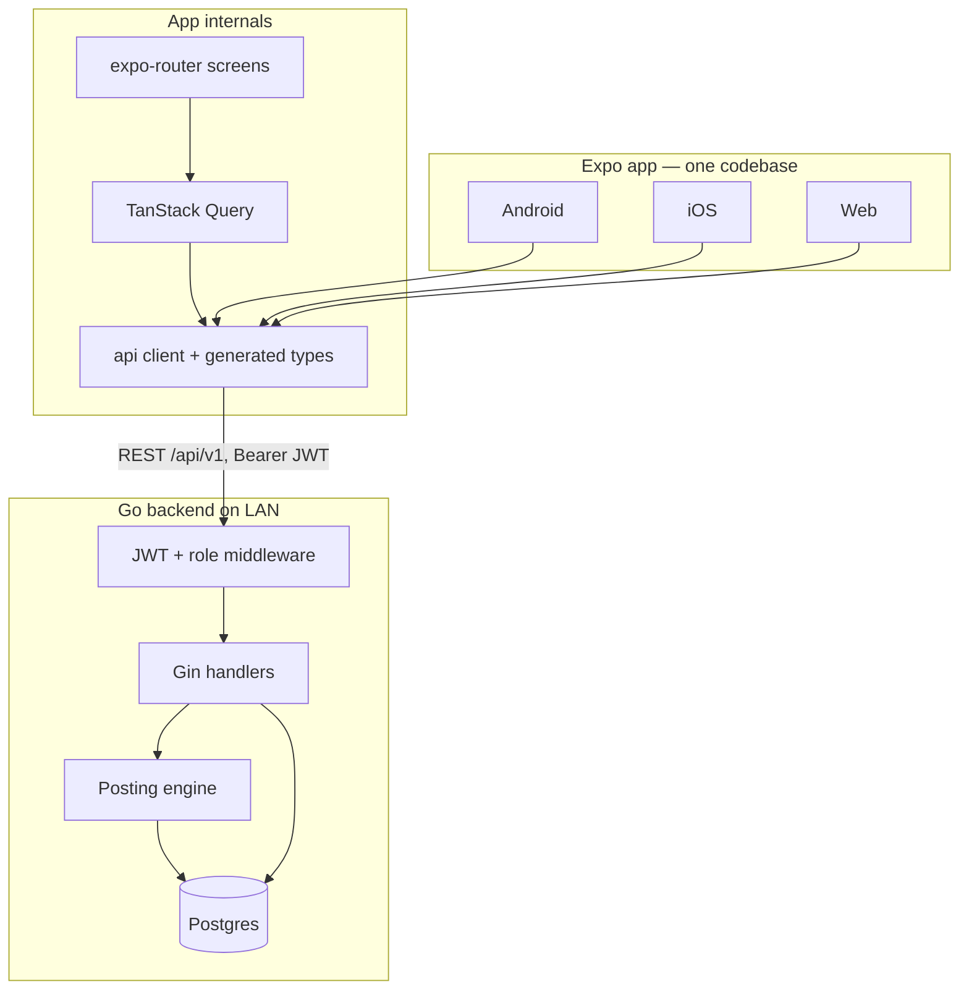

# Pocket Money — Master Plan (v2.1)

> v2.1 (2026-07-04): updated after Phase-0 landing + plan re-review — Phase 0 status, WP-0.2 re-scope, design-system pulled forward (WP-1.0), audit columns, entry immutability, negative-balance rule, backups, launch-readiness WPs in Phase 4, backlog additions.

> **Purpose of this document:** the single source of truth for evolving the existing MVP into the full product. It is written so that each Work Package (WP) can be handed to a coding agent (including smaller models) as a self-contained task with clear scope, contracts, and acceptance criteria.
>
> Reading order for an agent: §1 Vision → §5 Domain Model → the one WP it was assigned in §9 → §10 Conventions. Everything else is reference.

---

## 1. Vision & Scope

A cross-platform (Android / iOS / Web) family pocket-money tracker:

- The **head** (earning member, e.g. a parent) creates a **family group**, invites members, defines **chores** with amounts, sets a **base monthly pocket money (allowance)** per member, approves member-submitted work, approves **loan requests**, and records **payouts (settlements)**.
- **Members** (e.g. kids) see their own ledger and balance, log completed chores (pending approval), and request loans repaid via **EMI deducted from monthly pocket money**.
- Balance semantics: *balance = what the head currently owes a member* = approved credits (chores + allowance) − debits (settlements + EMIs).

Deployment target for now: backend on a home/LAN machine, clients on Android devices + web browser. Design must not assume the server is always running (see §5.4 Posting Engine).

### Product principles (the launch bar)

The initial launch must be **user-friendly, simple to use, and easily adoptable**. Every WP is judged against these, not just its acceptance criteria:

1. **Zero-training onboarding**: a new head goes register → create group → invite → first chore in under 3 minutes; a kid joins with one link tap. No manual, no explanation needed.
2. **≤ 2 taps for daily actions**: log a chore, approve/reject an entry, record a payout.
3. **Kid-legible UI**: friendly words ("Pocket money", not "Allowance credit ledger entry"), big clear amounts, obvious status colors (§7.4).
4. **Empty states teach**: every empty list says what to do next ("No chores yet — add your first one"), never a bare "No data".
5. **Nothing looks broken**: no dead tabs, no silent failures; every error is visible, human-readable, and recoverable.

## 2. Current State (as of 2026-07)

### What exists and works
| Area | State |
|---|---|
| Backend | Go + Gin + pgx + golang-migrate. Auth (register/login/JWT/me), groups, invites (token + expiry), members, chores CRUD (soft delete, head-only), ledger (create / list / approve / reject / pending / balance), settlements. Migrations 001–007. Some unit tests (auth, config, migrate). CI + Makefile + Dockerfile + docker-compose. |
| Settlement redesign | Already implemented per `docs/FE-bugs.md`: every group gets a non-deletable **system chore "Settlement"**; head records payouts as ledger entries against it with a custom amount. The separate `settlements` table/endpoints still exist but are superseded. |
| API contract | `backend/openapi.yaml` (~1.5k lines) exists. |
| Frontend | Expo + expo-router + TypeScript. Screens: login, register, dashboard, groups list/create/detail, chores, ledger, pending, settlements, invite (web query + deep link), profile. Hand-rolled fetch layer (`app/src/api.ts`), auth context, SecureStore/AsyncStorage token. |
| Docs | PRD, RFC, implementation plan, FE flow spec, FE bug list. |

### Known problems / gaps
1. **FE bugs** (`docs/FE-bugs.md`): chores tab and ledger tab broken; unauthorized/logout should redirect to login; ledger UX must match `docs/fe-flow.md` (unified ledger with inline approve/reject, strikethrough rejected, per-member view for head, no separate Pending/Settlements tabs).
2. **Missing product features**: monthly base allowance, loans + EMI, loan request/approval flow, member detail page for head.
3. **Money as floats**: DB uses `DECIMAL(12,2)` but Go/JSON/TS pass `float64`/`number`. Rounding bugs waiting to happen.
4. **Dead surface**: `settlements` endpoints/table and the separate `pending` endpoint/tab are superseded by the system-chore + unified-ledger design.
5. **Dependency skew** in `app/package.json` (expo ^54 with SDK-52-era libs like expo-router ~4, RN 0.76). Needs alignment to one SDK.
6. **FE has no data-fetching layer** (manual loading/error state per screen) and no design system (ad-hoc styles).

### Phase 0 status (2026-07-04)

- **WP-0.1 merged** (`da0a445`): app aligned to Expo SDK 54 / React 19 / RN 0.81. Review caught two web-only blockers that `expo-doctor`/`tsc` missed — `babel-preset-expo` not hoisted (bundle didn't compile) and corrupt placeholder PNGs (asset generation crashed) — both fixed; `npx expo export --platform web` now verified. Note: `app/assets/` icons are **1×1 placeholders**; real branding is WP-4.5. `expo-font ~14` is pinned deliberately (peer-dep fix), don't remove it.
- **WP-0.3 merged** (`3a8448a`): single root `AuthGate` handles all 401/logout redirects.
- **WP-0.4 merged** (`73f60b0`): chores tab works cross-platform (web `window.confirm`, visible errors, ₹, validation).
- **WP-0.2 in progress** (re-scoped, see §9).
- **Ledger tab remains broken by design** until WP-1.3 rebuilds it on ledger v2 — it is not patched in Phase 0. This makes Phase 1 the priority path after 0.2.

## 3. Tech Stack Decision

**Keep the current stack.** It is appropriate, already built, and well-structured:

- **Backend:** Go + Gin + pgx/v5 + golang-migrate + Postgres, JWT + bcrypt. No framework change.
- **Frontend:** Expo (React Native + RN Web) + expo-router + TypeScript. One codebase for Android/iOS/Web.

**Five targeted upgrades** (no rewrites):

1. **Money as integer minor units** (paise/cents): `BIGINT` in DB, `int64` in Go, `number` (integer) in JSON/TS. Field stays named `amount`; formatting to `₹x.yy` happens only in the UI. (WP-1.1)
2. **Contract-first workflow**: `backend/openapi.yaml` is the single source of truth. FE types are **generated** from it via `openapi-typescript` (`app/src/api-types.gen.ts`, committed). Any WP that changes the API must update the spec and regenerate. This is what keeps small-model agents from drifting.
3. **TanStack Query** on the FE for fetching/caching/invalidation. Removes per-screen loading/error boilerplate; agents follow a fixed query-key convention (§7.3).
4. **Lazy posting engine** instead of cron for monthly allowance & EMI entries (§5.4) — a home server that is sometimes off must not miss months.
5. **Design system**: one `app/src/theme.ts` (tokens) + small component kit (§7.4) so every screen an agent builds looks consistent.

Explicitly **not** doing now: microservices, GraphQL, ORM/sqlc migration, websockets/push, offline sync, cloud deploy. Revisit post-v2.

## 4. Architecture Overview



- Monorepo: `backend/` (Go) + `app/` (Expo) + `docs/`.
- All state on the server; clients refetch (on focus + pull-to-refresh via Query).
- AuthZ enforced **in the API** (head vs member per group), never only in the UI.

## 5. Domain Model v2

### 5.1 Unified ledger

Everything that changes a member's balance is a **ledger entry**. New columns on `ledger_entries`:

| Column | Type | Notes |
|---|---|---|
| `entry_type` | enum `chore \| allowance \| emi \| settlement \| adjustment` | existing rows backfilled: `settlement` if chore is the system chore, else `chore` |
| `direction` | enum `credit \| debit` | `chore`, `allowance`, positive `adjustment` → credit; `emi`, `settlement`, negative `adjustment` → debit. Amounts always stored **positive**. |
| `chore_id` | becomes **nullable** | null for `allowance` / `emi` / `adjustment` |
| `loan_id` | UUID FK `loans`, nullable | set on `emi` entries |
| `period` | `CHAR(7)` `YYYY-MM`, nullable | set on `allowance`/`emi`; unique partial index `(group_id, user_id, entry_type, period, loan_id)` where period is not null → idempotent posting |
| `note` | TEXT nullable | free text, shown in ledger |
| `decided_by` | UUID FK `users`, nullable | who approved/rejected (audit — "approved by Dad on Jul 3") |
| `decided_at` | timestamptz, nullable | when the approve/reject happened |

**Balance(member) = Σ approved credits − Σ approved debits.** Rejected entries never count; pending entries shown but not counted.

Statuses stay `approved | pending_approval | rejected`. Rules:
- Head-created entries → `approved` immediately.
- Member-created entries → `pending_approval` (members can only create `chore` entries, for themselves, with the chore's configured amount).
- Machine-posted entries (`allowance`, `emi`) → `approved`.
- `settlement` and `adjustment` → head only. `settlement`/`adjustment` accept a custom amount.
- **Entries are immutable** — no edit or delete endpoints. Mistakes are corrected with an `adjustment` entry whose note explains why. This keeps the ledger a trustworthy audit trail (the product's core promise) and keeps the API simple.
- Approve/reject sets `decided_by`/`decided_at`; the UI shows it ("approved by Dad, 3 Jul") so disputes are answerable.

The legacy `settlements` table and `/settlements`, `/pending` endpoints are removed in WP-1.2 (data migrated into ledger as `settlement` entries).

### 5.2 Allowances (base monthly pocket money)

New table `allowances`:

```
id UUID PK, group_id FK, user_id FK, amount BIGINT (minor units, >=0),
effective_from CHAR(7) 'YYYY-MM', created_by FK users, created_at
UNIQUE (group_id, user_id, effective_from)
```

- Head sets/changes a member's allowance; a change is a **new row** with a new `effective_from` (history preserved, past months unaffected).
- For each month M ≥ effective_from (and ≥ member's join month), the posting engine creates one approved `allowance` credit for the amount in force during M. Amount 0 = paused. The join month gets the full allowance (no proration — keep it simple and generous).
- **Cadence is monthly-only in v2** (`period` = `YYYY-MM`). Weekly pocket money is a real family pattern but is deliberately deferred (backlog §8) — do not widen the period format speculatively; a later migration can extend it.

### 5.3 Loans & EMI

New table `loans`:

```
id UUID PK, group_id FK, user_id FK (borrower),
principal BIGINT >0, installments INT >0, emi_amount BIGINT >0,
start_period CHAR(7), status enum: requested | active | rejected | closed,
note TEXT, requested_at, decided_by FK users NULL, decided_at NULL
```

Semantics (family-friendly, zero interest):
- **Member requests** a loan: principal + number of months (+ note). `emi_amount = ceil(principal / installments)`; the **last** installment absorbs rounding so Σ EMIs = principal.
- **Head approves** (may edit principal/installments before approving) → status `active`, `start_period` = next calendar month. Head hands over the cash outside the app; the disbursement is *not* a balance debit — repayment happens via EMIs.
- Each month from `start_period`, the posting engine posts one approved `emi` **debit** (linked via `loan_id`, idempotent by period) until `installments` are posted, then sets status `closed`.
- **Outstanding = principal − Σ posted EMIs.** Shown on loan cards.
- Head can also create a loan directly (pre-approved). Rejecting sets `rejected`. Early payoff: head "closes" the loan → one final `emi` debit for the outstanding amount, status `closed`.
- **Negative balances are allowed**: EMIs post unconditionally, so a member's balance can go below zero (the member temporarily owes the head). The UI must show this clearly (`−₹…` in danger color with an "owes" hint), never hide or clamp it. The loan-approval sheet should show the resulting EMI next to the member's allowance so heads size loans sensibly.

### 5.4 Posting engine (no cron)

A pure function `PostDue(groupID, now)` in `backend/internal/posting/`:

1. For every member+allowance in force: insert missing approved `allowance` entries for each month from max(effective_from, join month, last posted) through the current month.
2. For every `active` loan: insert missing `emi` entries for due periods; close loans whose installments are all posted.
3. All inserts rely on the unique partial index → naturally idempotent; run inside one transaction per group. Inserts use `ON CONFLICT DO NOTHING` against that index so two concurrent lazy triggers race safely (the loser silently no-ops, never 500s).

Triggered lazily at the start of `GET /groups/:id`, `GET .../ledger`, `GET .../balance` (cheap no-op when nothing is due). This guarantees correctness even if the server was off for months.

### 5.5 Authorization matrix

| Action | Head | Member |
|---|---|---|
| Group CRUD, invite, member list | ✅ | list/view only |
| Chores create/update/delete | ✅ | ❌ (read only) |
| Ledger: create chore entry | ✅ for anyone (approved) | ✅ self only (pending) |
| Ledger: settlement / adjustment | ✅ | ❌ |
| Ledger: approve/reject | ✅ | ❌ |
| Ledger: read | all members' | own only (API-enforced) |
| Allowance set/change | ✅ | read own |
| Loan: request | ✅ (create pre-approved) | ✅ (requested) |
| Loan: approve/reject/close | ✅ | ❌ |
| Loan: read | all | own only |

## 6. Backend Design

### 6.1 New/changed API surface (delta to openapi.yaml)

```
# Allowances
GET    /groups/:id/allowances                 head: all members; member: own
PUT    /groups/:id/allowances/:userId         head only  {amount, effective_from?}
# Loans
GET    /groups/:id/loans?user_id=&status=     head: all; member: own
POST   /groups/:id/loans                      member→requested; head→active {user_id?, principal, installments, note?}
POST   /loans/:id/approve                     head {principal?, installments?}  → active
POST   /loans/:id/reject                      head
POST   /loans/:id/close                       head (early payoff)
# Ledger (changed)
POST   /groups/:id/ledger                     body gains entry_type; settlement/adjustment head-only w/ custom amount
GET    /groups/:id/ledger?user_id=&status=&type=&period=
GET    /groups/:id/balance                    unchanged shape, new math
# Member summary (for head's member-detail page & dashboard)
GET    /groups/:id/members/:userId/summary    {balance, month_earned, allowance, active_loans[], recent_entries[]}
# Removed
/groups/:id/settlements, /groups/:id/pending
```

Error shape stays `{"error": "message"}` with 400/401/403/404/409/500.

### 6.2 Migration sequence (new files in `backend/migrations/`)

- `008_money_to_minor_units`: `ALTER ... amount TYPE BIGINT USING round(amount*100)` on chores + ledger_entries (+ settlements until dropped).
- `009_ledger_v2`: entry_type, direction, nullable chore_id, loan_id, period, note, **decided_by/decided_at** (backfill nulls — historic decisions weren't recorded), backfill, unique partial index.
- `010_allowances`.
- `011_loans` (+ FK from ledger_entries.loan_id).
- `012_drop_settlements`: migrate rows into ledger (`entry_type='settlement'`, direction debit, approved), then drop table.

### 6.3 Code layout (unchanged pattern)

`internal/handlers` (HTTP + validation + authz) → `internal/db` (repos, SQL) → `internal/posting` (new, pure logic + repo interface, unit-testable without HTTP). Keep the existing repo-per-entity style; new entities follow it (`allowance_repo.go`, `loan_repo.go`).

### 6.4 Testing

- Unit: posting engine (idempotency, month math incl. join-month edge, EMI rounding, loan close), balance math, authz on every new handler.
- Integration: repo tests against Postgres via existing `testutil/db.go` + `docker-compose.test.yml`.
- Every WP: `make -C backend test lint` must pass.

## 7. Frontend Design

### 7.1 Navigation map (expo-router)

```
(auth)/login, (auth)/register
(app)/
  index.tsx                      Dashboard: sectioned groups (Head of / Member of) + create/join
  profile.tsx                    (keep as is)
  groups/[id]/
    _layout.tsx                  Tabs: Overview | Chores | Loans
    index.tsx        Overview    HEAD: member cards (name, balance, pending count) → member detail
                                 MEMBER: own summary header + own unified ledger
    chores.tsx                   list (system chore pinned); head: add/edit/soft-delete
    loans.tsx                    member: my loans + "Request loan"; head: all loans, approve/reject/close
    members/[userId].tsx         HEAD-only member detail: balance, allowance (editable), loans,
                                 full ledger w/ inline approve/reject, "Add entry" (incl. settlement/adjustment)
invite.tsx                       token via web query or deep link → join → redirect to group
```

Per `docs/FE-bugs.md`: **no** Pending tab, **no** Settlements tab. Pending entries appear inline in ledgers with Approve/Reject buttons; rejected entries render strikethrough; only approved count toward totals.

### 7.2 Ledger row anatomy (the core UI element)

`[type icon] Title (chore name / "Pocket money — Jul 2026" / "EMI 3/12 — <loan note>" / "Settlement") · date · note` + right-aligned signed amount (credits `+₹` green, debits `−₹` red) + StatusBadge (pending) / strikethrough (rejected) + Approve/Reject buttons (head, pending only). Group rows by month with a month-total header.

### 7.3 Data layer

- `app/src/api-types.gen.ts` generated from openapi.yaml (never hand-edited).
- Thin fetch client (keep current 401→logout redirect behavior, fix per bug list).
- TanStack Query, query keys: `['groups']`, `['group', id]`, `['ledger', groupId, filters]`, `['balance', groupId]`, `['chores', groupId]`, `['loans', groupId]`, `['allowances', groupId]`, `['member-summary', groupId, userId]`. Mutations invalidate the affected group's keys. `refetchOnWindowFocus` + pull-to-refresh on lists.

### 7.4 Design system (`app/src/theme.ts` + `app/src/components/`)

Built early — core kit in **WP-1.0**, legacy-screen sweep in WP-4.1 — so every screen from Phase 1 onward is born on it. Friendly, simple, kid-legible:

- **Tokens**: primary `#4F46E5` (indigo), success `#16A34A`, danger `#DC2626`, warning/pending `#D97706`, neutral grays; spacing 4/8/12/16/24; radius 12; type scale 13/15/17/22/28 with money amounts in a tabular-nums bold style.
- **Components**: `Button` (primary/secondary/danger/ghost), `Card`, `ListRow`, `AmountText` (signed + colored + ₹ formatting from minor units), `StatusBadge`, `Avatar` (initials, color hashed from user id), `Sheet` (bottom-sheet overlay for all create forms; modal on web), `TextField`, `MonthHeader`, `EmptyState`/`ErrorMessage`/`LoadingSpinner` (exist), `Toast`.
- **Patterns**: every list has empty state + pull-to-refresh; every form validates before submit and disables the button while pending; destructive actions confirm; one primary action per screen as a prominent button (or FAB on mobile).
- Light mode only for now; keep colors in tokens so dark mode is a later WP.

## 8. Product Backlog (post-v2 candidates, in rough priority order)

1. **Savings goals / wishlist** — member sets a goal ("₹2500 for LEGO"), progress bar vs balance.
2. **Bonus/penalty quick actions** — head one-tap `adjustment` presets.
3. **Monthly summary** — per-member month report (earned / paid out / EMIs); later PDF/share.
4. **Notifications** — Expo push: entry approved/rejected, loan decided, allowance posted.
5. **Recurring chores / schedules** — "water plants, daily, ₹5" with per-day claim.
6. **Kid-friendly login** — PIN/avatar login for young kids on a shared device.
7. **Multiple heads / co-parent role**; transfer headship.
8. **Currency per group** + i18n.
9. **Password reset & email verification** (needed before any non-LAN deployment).
10. **Cloud deploy + HTTPS** (Fly.io/VPS), then app-store distribution. (Backups are NOT deferred here — see WP-1.4.)
11. **Interest on savings ("Bank of Mom/Dad")** — head sets an interest rate on positive balances; posted monthly by the existing engine as an `adjustment`-style credit. Teaches saving; very on-brand.
12. **Chore claiming / assignment** — head assigns chores or members "claim" them, preventing double-claims on the same task. Pairs with #5 recurring chores.
13. **Photo proof on chore entries** — kid attaches a photo when submitting; head approves with evidence. Needs file storage → post-v2.
14. **Weekly allowance cadence** — extend `period` beyond monthly (see §5.2 note).
15. **CSV / monthly export** — trivially derived from the ledger; fold into #3 monthly summary.

## 9. Roadmap — Phases & Work Packages

Rules: one WP = one agent task = one branch/PR. Each WP lists its contract; if BE and FE are both touched they are split. Do phases in order; WPs inside a phase marked ∥ can run in parallel.

### Phase 0 — Stabilize the MVP
| WP | Status | Scope | Acceptance criteria |
|---|---|---|---|
| **0.1** FE deps alignment | ✅ `da0a445` | Align `app/package.json` to one Expo SDK (latest stable); app boots on web + Android | `npx expo-doctor` clean; login→dashboard works on web & Android |
| **0.2** Generated API types + Query *(re-scoped)* | ⏳ | Add `openapi-typescript` codegen script; introduce TanStack Query provider; migrate **only the surviving screens** (dashboard, chores, profile, invite) to hooks. Do **not** migrate the ledger/pending/settlements screens — WP-1.3 deletes and rebuilds them on Query directly. Also add a **CI web-export smoke job** (`npx expo export --platform web`) — WP-0.1's review found two bundle-only blockers that `expo-doctor`/`tsc` missed. | codegen script in `app/package.json`; no hand-written response types remain in the migrated screens; CI runs the web export and it passes |
| **0.3** Auth redirects (bug) | ✅ `3a8448a` | 401 anywhere and logout both land on login screen, on all 3 platforms | manual matrix: expired token, logout — web + Android |
| **0.4** ∥ Fix chores tab (bug) | ✅ `73f60b0` | Chores list/create/edit/soft-delete per §5.5; system chore pinned, not editable | head CRUD works; member read-only; system chore protected (API already enforces) |

> **Known-broken until Phase 1:** the ledger tab. It is deliberately *not* patched here — WP-1.3 rebuilds it on ledger v2. Consequence: **start Phase 1 immediately after 0.2**; it is the shortest path to a fully-working app.

### Phase 1 — Ledger v2 (backend first)
| WP | Scope | Acceptance criteria |
|---|---|---|
| **1.0** ∥ Design-system core | Create `app/src/theme.ts` tokens + the core kit from §7.4: `Button`, `Card`, `ListRow`, `AmountText`, `StatusBadge`, `Sheet`, `TextField`, `MonthHeader`, `Toast` (+ existing `EmptyState`/`ErrorMessage`/`LoadingSpinner` moved onto tokens). Pulled forward from old WP-4.1 so Phases 1–3 build every new screen on it **once** instead of sweeping later. Re-skin the chores screen as the proof-of-use. | components exist, token-driven, typed; chores screen uses them; no behavior change |
| **1.1** ∥ Money to minor units | Migration 008; Go models/handlers to int64; openapi.yaml amounts → integer; regenerate FE types; FE formats via `AmountText` (from WP-1.0) | all tests pass; grep shows no float64 money in backend |
| **1.2** Ledger v2 schema + API | Migrations 009 + 012; entry_type/direction/note/decided_by/decided_at; settlement rows migrated; `/settlements` + `/pending` removed; ledger create/list per §6.1; balance = credits−debits; openapi updated | integration tests: balance math, member-can't-see-others, head-only settlement/adjustment, decided_by recorded on approve/reject |
| **1.3** FE unified ledger | Rebuild group Overview per §7.1/§7.2 for both roles **on the WP-1.0 kit**; inline approve/reject; strikethrough rejected; month grouping; "decided by" shown on decided entries; remove Pending/Settlements screens | matches `docs/fe-flow.md` + `docs/FE-bugs.md` behaviors on web + Android |
| **1.4** ∥ Backups | `make backup` / `make restore` (pg_dump/pg_restore) + a documented cron one-liner. This is a home server holding the family's money ledger — disk death must not lose it. Deliberately early, not part of cloud deploy. | backup produces a restorable dump; restore verified against a scratch DB; documented in README |

### Phase 2 — Allowances
| WP | Scope | Acceptance criteria |
|---|---|---|
| **2.1** BE allowances + posting engine | Migration 010; allowance endpoints; `internal/posting` with allowance posting; wire lazy trigger | unit tests: idempotency (call twice → no dupes), mid-month join, amount change effective next `effective_from`, server-off-for-3-months backfill |
| **2.2** FE allowances | Head: set/edit allowance on member detail (WP-3.3 dependency-lite: can live on Overview member card sheet until then); member: allowance visible in summary; allowance rows render in ledger | change allowance → next month posts new amount; history not rewritten |

### Phase 3 — Loans & EMI
| WP | Scope | Acceptance criteria |
|---|---|---|
| **3.1** BE loans | Migration 011; loan endpoints (§6.1); EMI posting in engine; rounding rule; auto-close; early payoff | unit tests: ceil rounding w/ last-installment fixup (e.g. 1000/3 → 334,334,332), idempotent periods, close |
| **3.2** FE loans | Loans tab per §7.1: member request flow; head approve (editable terms)/reject/close; loan card w/ progress (paid n/m, outstanding); EMI rows in ledger | full request→approve→EMI-appears flow on web + Android |
| **3.3** FE member detail page | `members/[userId]` for head per §7.1 incl. add settlement/adjustment via Sheet | head can run a whole month (approve chores, view balance, settle) from this page |

### Phase 4 — UX polish & launch readiness
| WP | Scope | Acceptance criteria |
|---|---|---|
| **4.1** Design-system sweep | Sweep the **legacy** screens (login, register, dashboard, profile, invite) onto the WP-1.0 kit — much smaller than before since Phases 1–3 screens were born on it | no inline hex colors in screens; visual consistency checklist |
| **4.2** ∥ Dashboard v2 | Sectioned dashboard per `docs/fe-flow.md` (head groups w/ member count + total owed; member groups w/ own balance) | needs a `GET /groups` summary enrichment (small BE addendum, spec first) |
| **4.3** ∥ Invite/share polish | Web: copy + toast; mobile: native share sheet; join lands in group | per fe-flow.md |
| **4.4** E2E + seed | `make seed` (demo family), Maestro (mobile) or Playwright (web) happy-path e2e; docker-compose runs full stack | one command brings up BE+DB+web with seed data; e2e green in CI |
| **4.5** ∥ Branding assets | Replace the 1×1 placeholder PNGs from WP-0.1 with real app icon, splash, adaptive icon, favicon; app display name | assets pass `expo-doctor` + render correctly on all 3 platforms |
| **4.6** ∥ Onboarding & first-run | Auto-login after register (PRD [Proposed]); first-run dashboard guides the head ("Create your family group") and the invited member (invite link → join → land in group); empty states per §1 principles across all screens | a new family completes register→group→invite→first chore→first approval with zero guidance, <3 min (§1 bar) |
| **4.7** ∥ Account & membership hygiene | Change password (logged-in, no email infra needed); head can remove a member (allowed only when balance is settled to 0 and no active loans — history/ledger rows are kept); member can leave under the same conditions | authz tests: only head removes others, anyone may leave self; removal blocked while balance ≠ 0 or a loan is active, with a human-readable error |

### Phase 5+ — Backlog items from §8, one WP each, spec-first.

## 10. Conventions for Coding Agents (Definition of Done)

1. **Contract first**: an API change starts with `backend/openapi.yaml`, then BE implementation, then `npm run codegen` in `app/`. Never let the three drift.
2. **Stay in your WP**: don't refactor outside the listed scope; note discoveries in `docs/notes/` instead.
3. **Verify**: BE → `make -C backend test lint`; FE → `npx tsc --noEmit` + boot on web (`npm run web`) and exercise the changed flow. State in the PR what you ran. **FE verification floor:** if your environment cannot run a browser/dev server, you MUST at minimum run `npx expo export --platform web` and have it succeed — `expo-doctor` and `tsc` do not catch bundle-level breakage (proven in WP-0.1 review: two web-only blockers passed both).
4. **Migrations**: always paired up/down, numbered sequentially, idempotent to re-run on a fresh DB.
5. **AuthZ in the API**, mirrored in UI (hide what the role can't do — per §5.5 matrix).
6. **Money**: integers (minor units) everywhere except UI formatting. Never `parseFloat` user money input — parse to minor units (`"12.50" → 1250`).
7. **Dates/periods**: months are `YYYY-MM` strings in the server's local timezone; the server is the clock authority.
8. **UI**: reuse §7.4 components; every list gets empty/loading/error states; forms validate before submit.
9. **Commits/PRs**: reference the WP id (e.g. `WP-2.1: allowance posting engine`).

## 11. Model Selection per Pipeline Stage

Principle: spend the strong model on **spec** and **review**; implementation is the mechanical part once the contract is written.

| Stage | Default | Notes |
|---|---|---|
| Spec | Opus | Resolves ambiguity; output is small (openapi delta, schema, acceptance criteria) so strong-model cost is negligible. Commit the spec to `docs/specs/WP-x.y.md` **before** implement starts. |
| Implement | Sonnet | Sufficient for well-specified WPs. Haiku for mechanical ones (0.1, 0.2, 4.3, simple screens). |
| Review | Opus | Use a different, stronger model than the implementer. Check the invariants: money math (§5.1), authz matrix (§5.5), migration up/down, posting idempotency (§5.4), types regenerated. |

**Risk overrides:**
- High-risk WPs (1.1, 1.2, 2.1, 3.1 — migrations, balance semantics, posting engine, EMI math): Opus for implement too, or Sonnet implement + strict Opus review with §5 invariants in the review prompt; posting-engine unit tests must exist before review passes.
- Low-risk FE WPs (0.4, 2.2, 4.1, 4.2, 4.3): Sonnet spec → Sonnet/Haiku implement → Sonnet review.
- Never skip review entirely — even cheap review catches unregenerated types, out-of-scope edits, and missing empty/error states.
