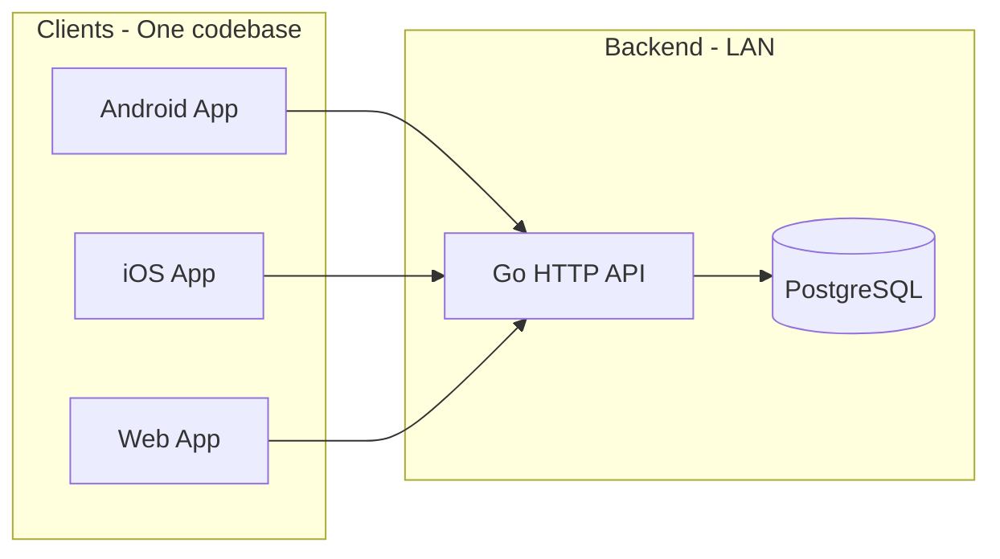

# Pocket Money MVP – Implementation Plan

**Tech stack (final):**

- **Frontend:** React Native + Expo with React Native Web (one codebase for Android, iOS, Web).
- **Backend:** Go (Golang) with PostgreSQL; HTTP REST APIs; JWT auth; bcrypt for passwords.

**MVP deployment:** Backend runs on your machine (LAN); all clients point to `http://<LAN-IP>:8080` (or configured base URL).

---

## 1. Repository and project structure

**Option A – Monorepo (recommended for MVP):**

```
pocket-money/
├── backend/          # Go API + migrations
│   ├── cmd/server/
│   ├── internal/     # handlers, db, auth, models
│   ├── migrations/
│   ├── go.mod
│   └── ...
├── app/              # React Native + Expo (shared for Android, iOS, Web)
│   ├── src/
│   ├── app.json
│   ├── package.json
│   └── ...
└── README.md
```

**Option B – Two repos:** `pocket-money-backend` (Go) and `pocket-money-app` (Expo). Use if you prefer separate versioning; API contract can be documented (OpenAPI) for clarity.

Use **monorepo** unless you have a reason to split.

---

## 2. Backend (Go + PostgreSQL)

### 2.1 Stack and tooling

| Item             | Choice                                                                                            |
| ---------------- | ------------------------------------------------------------------------------------------------- |
| Router / HTTP    | Gin or Echo (or `net/http`); recommend **Gin** for middleware (CORS, auth, logging).              |
| DB driver        | **pgx/v5** (`github.com/jackc/pgx/v5`).                                                           |
| Migrations       | **golang-migrate** (`github.com/golang-migrate/migrate/v4`) – SQL files in `backend/migrations/`. |
| Password hashing | **bcrypt** (`golang.org/x/crypto/bcrypt`).                                                        |
| JWT              | **golang-jwt** (`github.com/golang-jwt/jwt/v5`).                                                  |
| Config           | Env vars: `PORT`, `DATABASE_URL`, `JWT_SECRET`, `CORS_ORIGINS` (for web).                         |

### 2.2 Data model and migrations

**Tables:**

- **users** – `id` (UUID), `email` (unique), `password_hash`, `name`, `dob` (date), `sex`, `created_at`.
- **groups** – `id` (UUID), `name`, `head_user_id` (FK users), `created_at`.
- **group_members** – `group_id` (FK), `user_id` (FK), `role` (enum: head, member), `joined_at`; unique (group_id, user_id).
- **chores** – `id` (UUID), `group_id` (FK), `name`, `description`, `amount` (decimal), `created_at`.
- **ledger_entries** – `id` (UUID), `group_id` (FK), `user_id` (FK, member who earned), `chore_id` (FK), `amount`, `status` (enum: approved, pending_approval, rejected), `created_by_user_id`, `approved_by_user_id`, `rejected_by_user_id`, `created_at`.
- **settlements** – `id` (UUID), `group_id` (FK), `user_id` (FK), `amount`, `date`, `note`, `created_at`.
- **invite_tokens** (optional but recommended) – `id` (UUID), `group_id` (FK), `token` (unique), `expires_at`, `created_at`; used for invite links.

**Indexes:** FK columns; `users.email`; `ledger_entries(group_id, status)`; `invite_tokens(token)`.

**Migrations:**

- `001_create_users.up.sql` / `.down.sql`.
- `002_create_groups_and_members.up.sql` / `.down.sql`.
- `003_create_chores.up.sql` / `.down.sql`.
- `004_create_ledger_entries.up.sql` / `.down.sql`.
- `005_create_settlements.up.sql` / `.down.sql`.
- `006_create_invite_tokens.up.sql` / `.down.sql`.

### 2.3 API design (REST)

**Base URL:** `http://<LAN-IP>:8080/api/v1` (or env). All authenticated routes use header: `Authorization: Bearer <JWT>`.

| Method | Path                    | Auth       | Description                                                                                                              |
| ------ | ----------------------- | ---------- | ------------------------------------------------------------------------------------------------------------------------ |
| POST   | /auth/register          | No         | Body: email, password, name, dob, sex → 201 + user (no password).                                                        |
| POST   | /auth/login             | No         | Body: email, password → 200 + JWT + user.                                                                                |
| GET    | /auth/me                | Yes        | Current user.                                                                                                            |
| GET    | /groups                 | Yes        | List groups where user is member.                                                                                        |
| POST   | /groups                 | Yes        | Create group (caller becomes head). Body: name.                                                                          |
| GET    | /groups/:id             | Yes        | Group detail + members + chores count.                                                                                   |
| POST   | /groups/:id/invite      | Yes (head) | Generate invite link; body optional (expiry). Response: invite_url, token, expires_at.                                   |
| POST   | /groups/join            | No         | Body: token (invite token) → join group as member; 200 + group.                                                          |
| GET    | /groups/:id/members     | Yes        | List members with roles.                                                                                                 |
| GET    | /groups/:id/chores      | Yes        | List chores.                                                                                                             |
| POST   | /groups/:id/chores      | Yes (head) | Create chore. Body: name, description, amount.                                                                           |
| PATCH  | /chores/:id             | Yes (head) | Update chore.                                                                                                           |
| DELETE | /chores/:id             | Yes (head) | Delete (or soft-delete) chore.                                                                                           |
| GET    | /groups/:id/ledger      | Yes        | List ledger entries (filter by status optional).                                                                        |
| POST   | /groups/:id/ledger      | Yes        | Head: create approved entry. Member: create pending_approval. Body: user_id (for head), chore_id, amount, optional date.  |
| POST   | /ledger/:id/approve     | Yes (head) | Set status approved.                                                                                                     |
| POST   | /ledger/:id/reject      | Yes (head) | Set status rejected.                                                                                                     |
| GET    | /groups/:id/pending     | Yes (head) | List entries with status pending_approval.                                                                               |
| GET    | /groups/:id/balance     | Yes        | Per-member balance (sum approved ledger − sum settlements).                                                              |
| GET    | /groups/:id/settlements | Yes        | List settlements.                                                                                                        |
| POST   | /groups/:id/settlements | Yes (head) | Create settlement. Body: user_id, amount, date, note.                                                                    |

**Errors:** 400 validation, 401 unauthorized, 403 forbidden (e.g. not head), 404 not found, 500 server. Consistent JSON: `{ "error": "message" }` or `{ "errors": [...] }`.

### 2.4 Backend implementation order

- Project init: `go mod init`, Gin, pgx, migrate, bcrypt, JWT.
- Config: load PORT, DATABASE_URL, JWT_SECRET, CORS_ORIGINS from env.
- Migrations: run up on startup (or separate migrate command); implement all 6 migration files.
- DB layer: connection pool; structs for User, Group, Chore, LedgerEntry, Settlement, InviteToken; repository-style functions or simple queries in packages.
- Auth: register (bcrypt hash, insert user); login (find user, bcrypt compare, issue JWT); middleware that validates JWT and sets user ID in context.
- CORS middleware: allow configured origins (web app URL and Expo web).
- Groups: create, list, get by ID; group_members insert (head).
- Invite: create invite token, return URL (e.g. `http://<host>:<web-port>/invite?token=xxx` or deep link); join by token (validate, add member).
- Chores: CRUD (head-only where specified).
- Ledger: create (head → approved, member → pending_approval); list; approve/reject (head); balance query.
- Settlements: create (head), list.
- Integration: wire routes; test with curl or Postman.

---

## 3. Frontend (React Native + Expo + React Native Web)

### 3.1 Stack and tooling

| Item         | Choice                                                                                                |
| ------------ | ----------------------------------------------------------------------------------------------------- |
| Framework    | Expo SDK 52+ (React Native + React Native Web).                                                       |
| Language     | TypeScript.                                                                                           |
| Navigation   | **expo-router** (file-based) or **React Navigation**; recommend **expo-router** for one codebase.   |
| API client   | **fetch** or **axios**; single module with base URL from env/config (e.g. `EXPO_PUBLIC_API_URL`).     |
| Auth storage | **expo-secure-store** for token (and optionally user id); fallback **AsyncStorage** on web if needed. |
| Forms        | Controlled components; optional: **react-hook-form** + **zod** for validation.                      |
| UI           | Expo default; optional: **NativeWind** or **Tamagui** for faster styling.                               |

**Config:** `EXPO_PUBLIC_API_URL=http://192.168.1.x:8080/api/v1` (or your LAN IP). Web and mobile use same env/build-time variable so one codebase works.

### 3.2 App structure (expo-router style)

- **app/** – Routes: `_layout.tsx` (root layout, auth check), `index.tsx` (redirect to login or home), `(auth)/login.tsx`, `(auth)/register.tsx`, `(app)/_layout.tsx` (tabs after login), `(app)/index.tsx` (dashboard), `(app)/groups/index.tsx`, `(app)/groups/[id].tsx`, `(app)/groups/[id]/chores.tsx`, `(app)/groups/[id]/ledger.tsx`, `(app)/groups/[id]/settlements.tsx`, `(app)/groups/[id]/pending.tsx` (head), `invite.tsx` (query param `?token=xxx` – join flow).
- **src/** (or components/): `api.ts` (base URL, getToken, request wrappers), `auth-context.tsx` (user, token, login, logout, loadMe), `components/` (buttons, inputs, list items).

### 3.3 Screens and flows

- **Registration:** Form (name, email, password, DOB, sex) → POST /auth/register → then login or auto-login.
- **Login:** Email + password → POST /auth/login → store token + user → redirect to home.
- **Dashboard (home):** List groups; "Create group"; "Join via link" (navigate to invite or paste token).
- **Group detail:** Tabs or stack: Overview, Members, Chores, Ledger, Settlements, Pending (head only). Show balance per member on overview/ledger.
- **Chores (head):** List; add chore (name, description, amount); edit/delete.
- **Ledger:** List entries (approved, pending, rejected); head: "Add entry" (pick member, chore, amount); member: "Add entry" (pick chore, amount → pending). Head: "Approve" / "Reject" from Pending tab or ledger.
- **Settlements (head):** List; "Add settlement" (member, amount, date, note).
- **Invite (head):** "Generate link" → GET or POST invite → show URL + copy button; share via WhatsApp etc.
- **Join (member):** Open `/invite?token=xxx` (web) or deep link `pocketmoney://invite?token=xxx` (mobile) → POST /groups/join with token → redirect to group.

### 3.4 Web vs native specifics

- **API base URL:** Same for all platforms; set in env (e.g. `EXPO_PUBLIC_API_URL`).
- **Deep link (mobile):** Scheme `pocketmoney` (or your app name); expo config for Android/iOS; handle in `invite.tsx` (read token from query).
- **Web invite:** Same `invite` route; token from query string; works when user opens link in browser.

### 3.5 Frontend implementation order

- Expo init (TypeScript); add React Native Web; configure app.json for web and mobile.
- API module: base URL from env; getToken (SecureStore/AsyncStorage); intercept 401 → logout.
- Auth context: login, register, logout, loadMe (GET /auth/me); persist token; redirect when unauthenticated.
- Root layout: if no token → auth routes; else app routes.
- Login and Register screens; wire to API.
- App layout: tabs (Dashboard, Groups, Profile or similar).
- Groups list (GET /groups); Create group (POST /groups); group detail (GET /groups/:id).
- Invite: generate link (POST invite); show and copy URL. Join: invite screen with token from URL → POST /groups/join.
- Chores: list, create, edit, delete (head only).
- Ledger: list; add entry (head vs member); balance display.
- Pending: list pending_approval; approve/reject buttons (head).
- Settlements: list; add settlement (head).
- Polish: loading states, error messages, empty states; test on Android, iOS, Web.

---

## 4. End-to-end flows (recap)

1. **Register → Login:** User registers, then logs in; token stored; dashboard shows groups.
2. **Create group:** User creates group, becomes head; can generate invite link and share.
3. **Join group:** Another user opens link (web or deep link); app calls join with token; user becomes member.
4. **Head: chores:** Head adds chores (name, description, amount).
5. **Head: ledger:** Head adds entry "user U did chore C" → status approved; balance updates.
6. **Member: ledger:** Member adds entry "I did chore C" → status pending_approval; head sees in Pending; head approves or rejects.
7. **Head: settlement:** Head adds settlement for a member (amount, date); balance decreases by that amount.
8. **Sync:** All data is on server; clients just refetch (e.g. on focus or pull-to-refresh).

---

## 5. Task checklist (implementation order)

**Phase 1 – Backend foundation**

1. Create monorepo structure; init Go module in `backend/`.
2. Add dependencies: Gin, pgx, migrate, bcrypt, JWT; config from env.
3. Write migrations 001–006 (users → invite_tokens); run migrations on startup.
4. Implement DB layer: connect, User/Group/Chore/LedgerEntry/Settlement/InviteToken structs and basic queries.
5. Implement auth: POST /auth/register, POST /auth/login, JWT issue/validate; GET /auth/me; auth middleware.
6. Add CORS middleware; wire health or root route.

**Phase 2 – Backend groups and invite**

7. POST /groups, GET /groups, GET /groups/:id; group_members insert for head.
8. POST /groups/:id/invite (create token, return URL); POST /groups/join (validate token, add member).
9. GET /groups/:id/members.

**Phase 3 – Backend chores, ledger, settlements**

10. Chores: GET list, POST create, PATCH update, DELETE delete (head-only where applicable).
11. Ledger: POST create (head → approved, member → pending_approval); GET list; GET balance.
12. POST /ledger/:id/approve, POST /ledger/:id/reject; GET /groups/:id/pending.
13. Settlements: POST create (head), GET list.

**Phase 4 – Frontend foundation**

14. Create Expo app in `app/`; TypeScript; add React Native Web; set EXPO_PUBLIC_API_URL.
15. API module (base URL, token, request/response); auth context (login, register, logout, loadMe, persist token).
16. Root layout: auth check; redirect to login or app.
17. Login and Register screens; connect to backend.

**Phase 5 – Frontend groups and invite**

18. Dashboard: list groups; Create group; navigate to group detail.
19. Group detail layout: tabs or stack (Overview, Members, Chores, Ledger, Settlements, Pending).
20. Invite: "Generate link" in group; copy/share URL. Invite route: read token from query (web) or deep link (mobile); POST join; redirect to group.

**Phase 6 – Frontend chores, ledger, settlements**

21. Chores screen: list, add, edit, delete (head only).
22. Ledger screen: list entries; "Add entry" (head: select member + chore; member: select chore only); show balance.
23. Pending screen (head): list pending entries; Approve / Reject.
24. Settlements screen: list; "Add settlement" (head only).
25. Polish: loading, errors, empty states; test Android, iOS, Web against LAN backend.

---

## 6. Out of scope for MVP

- Email verification; password reset.
- OAuth / social login.
- Rate limiting; request validation (beyond basic checks).
- HTTPS (LAN HTTP acceptable for MVP).
- Multi-group "current group" switching beyond basic list/detail (can be single group per user if you prefer).
- Offline support; conflict resolution.
- App store / Play Store deployment (local/dev build only for MVP).

---

## 7. Diagram – high-level architecture



This plan gives you a single frontend codebase (React Native + Expo + RN Web), a Go + PostgreSQL backend on LAN, and a clear task checklist to implement the MVP end to end.
