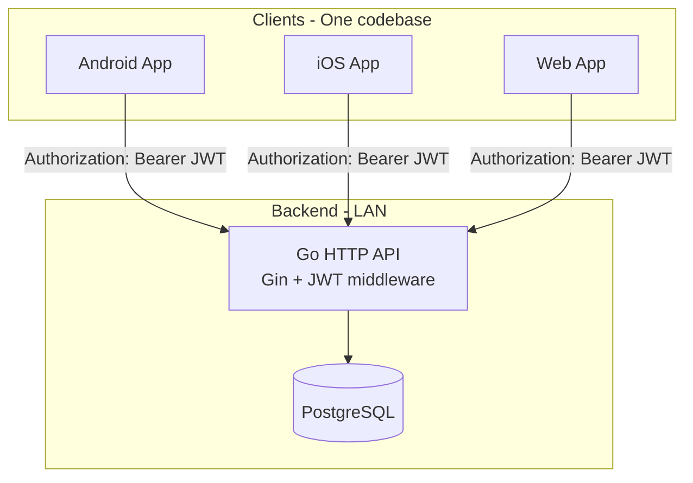
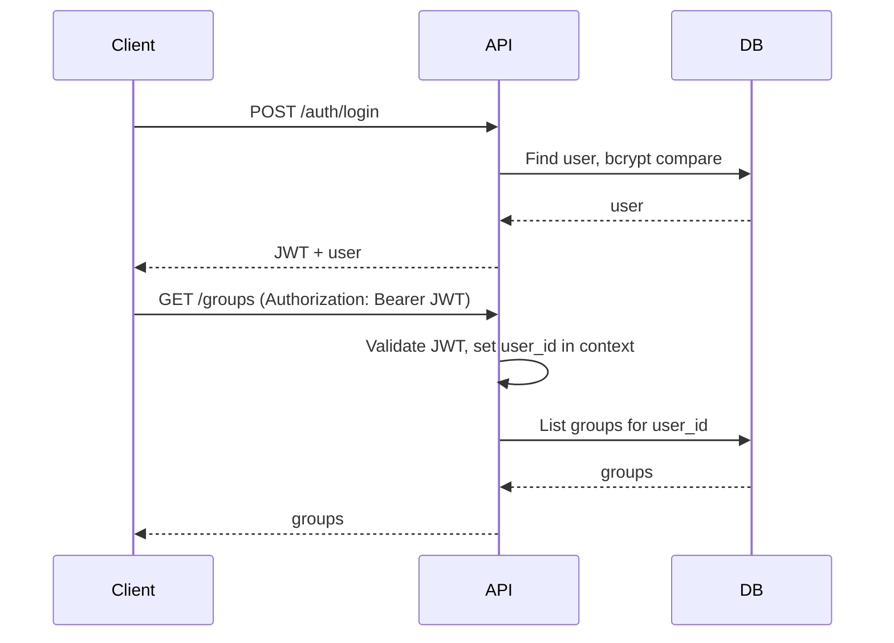
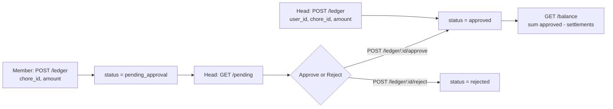

# RFC: Pocket Money MVP – System Architecture & Technical Proposal

---

## Abstract

This RFC proposes the technical architecture for **Pocket Money MVP**: a greenfield system comprising a **Go + PostgreSQL** backend (Gin, pgx, JWT, bcrypt) and a **React Native + Expo** frontend with **React Native Web** (one codebase for Android, iOS, Web). The backend runs on LAN with REST APIs for auth, groups, chores, ledger (with approval workflow), and settlements; the frontend uses **expo-router**, an **API module** with env-based base URL, and **auth context** with token persistence. The proposal adopts a **monorepo** layout, **JWT** for API auth, **invite tokens** for join links (web + deep link), and a clear phased implementation order. This document is the single technical reference for implementation and review.

---

## Context & Problem Statement

**Why this change is necessary:** Families and small groups need a single, auditable system to track chores, assign monetary values, record who completed what (ledger), approve or reject member-reported entries, and record cash settlements—without relying on spreadsheets, paper, or memory. There is no existing system; this is a greenfield build.

**Limitations and constraints:**

- **No existing codebase** – All design choices are from first principles; we must choose stack, repo layout, auth model, and API shape.
- **Multi-platform from day one** – The product must work on Android, iOS, and Web from a single frontend codebase to avoid maintaining three apps.
- **LAN-first deployment** – MVP runs on a home/LAN server; clients connect to `http://<LAN-IP>:8080`. This implies no cloud dependencies, no HTTPS requirement for MVP, and config via environment variables.
- **Clear authority model** – One **head** per group (e.g. parent) who creates chores, approves ledger entries, and records settlements; **members** (e.g. kids) join via invite and submit entries for approval. The system must enforce head vs. member permissions at the API layer.
- **Auditability** – Ledger entries have status (**approved**, **pending_approval**, **rejected**); balance is derived (sum approved ledger − sum settlements). The data model must support this without ambiguity.

---

## Proposed Solution

### High-level architecture

**Critical technical components:** **Gin** (router + CORS + auth middleware), **pgx/v5** (DB), **golang-migrate** (SQL migrations), **bcrypt** (passwords), **golang-jwt/jwt/v5** (tokens), **expo-router** (file-based routes), **expo-secure-store** / **AsyncStorage** (token persistence).

### Repository and layout

**Monorepo** under `pocket-money/`:

- **backend/** – Go module; `cmd/server/`, `internal/` (handlers, db, auth, models), **migrations/** (001–006).
- **app/** – Expo app; `src/` (api, auth-context, components), **app/** (routes: auth, app, invite).

Single repo keeps API and app in sync and simplifies local development (one clone, shared docs).

### Data model (backend)

**Core entities:**

| Table | Purpose |
|-------|--------|
| **users** | id (UUID), email (unique), password_hash, name, dob, sex, created_at |
| **groups** | id, name, head_user_id (FK users), created_at |
| **group_members** | group_id, user_id, role (head \| member), joined_at; unique (group_id, user_id) |
| **chores** | id, group_id, name, description, amount (decimal), created_at |
| **ledger_entries** | id, group_id, user_id (earner), chore_id, amount, status (approved \| pending_approval \| rejected), created_by_user_id, approved_by_user_id, rejected_by_user_id, created_at |
| **settlements** | id, group_id, user_id, amount, date, note, created_at |
| **invite_tokens** | id, group_id, token (unique), expires_at, created_at |

**Indexes:** FKs; **users.email**; **ledger_entries(group_id, status)**; **invite_tokens(token)**.

Migrations: `001_create_users` through `006_create_invite_tokens` (up/down SQL files).

### API design (REST)

**Base:** `http://<LAN-IP>:8080/api/v1`. Authenticated routes: **Authorization: Bearer &lt;JWT&gt;** header.

**Auth:** POST `/auth/register` (email, password, name, dob, sex) → 201 + user; POST `/auth/login` (email, password) → 200 + **JWT** + user; GET `/auth/me` (auth) → current user.

**Groups:** GET/POST `/groups` (list, create; caller becomes head); GET `/groups/:id` (detail + members + chores count); GET `/groups/:id/members`. **Invite:** POST `/groups/:id/invite` (head) → invite_url, token, expires_at; POST `/groups/join` (no auth) body `token` → join as member.

**Chores:** GET/POST `/groups/:id/chores` (list; create head-only); PATCH/DELETE `/chores/:id` (head-only).

**Ledger:** GET/POST `/groups/:id/ledger` (list with optional status filter; create: head → approved, member → pending_approval); POST `/ledger/:id/approve`, POST `/ledger/:id/reject` (head); GET `/groups/:id/pending` (head); GET `/groups/:id/balance` (per-member: sum approved − sum settlements).

**Settlements:** GET/POST `/groups/:id/settlements` (list; create head-only).

**Errors:** 400/401/403/404/500; JSON `{ "error": "message" }` or `{ "errors": [...] }`.

### Auth and permission flow

**Head vs. member:** Middleware resolves **group_id** from path, loads **group_members** for (group_id, user_id), checks **role = head** for routes that require it (invite, create chore, PATCH/DELETE chore, approve/reject ledger, create settlement). Return **403** if not head.

### Frontend structure (expo-router)

- **Root layout** – Auth check (token present + optional GET /auth/me); if no token → **(auth)** routes; else **(app)** routes.
- **Routes:** `(auth)/login.tsx`, `(auth)/register.tsx`; `(app)/index.tsx` (dashboard), `(app)/groups/[id].tsx` (tabs: Overview, Members, Chores, Ledger, Settlements, Pending); **invite.tsx** (query `?token=xxx` for web; deep link `pocketmoney://invite?token=xxx` on mobile).
- **API module** – Base URL from **EXPO_PUBLIC_API_URL**; **getToken()** from SecureStore (native) / AsyncStorage (web); wrapper that adds **Authorization** and handles **401** → logout/redirect.
- **Auth context** – login, register, logout, **loadMe** (GET /auth/me); persist token; expose user + token to app.

### Ledger and balance workflow

---

## Alternative Solutions

| Alternative | Description | Why passed over |
|-------------|-------------|------------------|
| **Two repositories** (backend + app separate) | `pocket-money-backend` and `pocket-money-app` with OpenAPI contract. | Adds coordination overhead for a small team; monorepo keeps API and app in sync and simplifies local dev. OpenAPI can be added later inside the monorepo if needed. |
| **Session-based auth (cookies)** | Server issues session ID in cookie; middleware validates session. | JWT chosen for stateless validation and simpler cross-platform client handling (no cookie handling on native). Session store would add state to the backend. |
| **PWA-only or separate native apps** | Build only a web PWA, or separate Android/iOS codebases. | PRD requires one codebase for Android, iOS, and Web. Expo + React Native Web satisfies this; PWA-only would drop native UX; separate apps would triple frontend maintenance. |
| **SQLite instead of PostgreSQL** | Single-file DB for simpler deployment. | PostgreSQL chosen for robust concurrency, UUID support, and future scalability if the product moves beyond LAN. Migrations (golang-migrate) work well with Postgres. |

---

## Trade-offs & Risks

| Trade-off | Choice | Sacrifice | Note |
|-----------|--------|-----------|------|
| **Reachability vs. simplicity** | LAN-only backend | No access from outside home network; no cloud. | Acceptable for MVP; later can add tunnel or cloud deploy. |
| **Single codebase vs. platform polish** | One Expo codebase for Android, iOS, Web | Some platform-specific UX or perf may be harder. | Maximizes velocity and consistency; platform-specific tweaks can be added incrementally. |
| **JWT vs. refresh/session** | JWT only (no refresh token in MVP) | Token expiry forces re-login unless long-lived JWT. | Simpler; no refresh endpoint or rotation. **Gotcha:** set reasonable **JWT expiry** (e.g. 7d) and document re-login behavior. |
| **HTTP vs. HTTPS** | HTTP on LAN for MVP | No transport encryption. | Acceptable on trusted LAN; document that HTTPS is required for any non-LAN or production use. |
| **No offline** | All data on server; refetch on focus/pull | No use without network. | Keeps logic on server and avoids sync/conflict resolution; acceptable for MVP. |
| **Invite token in URL** | Token in query (web) and deep link (mobile) | Token visible in history/shared links; if not expired, anyone with link can join. | Mitigate with **expires_at** and optional single-use semantics later. **Gotcha:** validate **expires_at** on POST /groups/join. |

**Other risks:** **CORS** must include web app origin (and Expo web dev URL) or web client will be blocked. **Deep link** scheme (e.g. `pocketmoney`) must be configured in **app.json** and tested on device. **Head check** must be enforced on every privileged route to avoid privilege escalation.

---

## Infrastructure & Security

| Area | Impact / requirement |
|------|------------------------|
| **Stack** | **Backend:** Go 1.21+; PostgreSQL (version compatible with pgx); env: **PORT**, **DATABASE_URL**, **JWT_SECRET**, **CORS_ORIGINS**. **Frontend:** Node 18+; Expo SDK 52+; env: **EXPO_PUBLIC_API_URL** (e.g. `http://192.168.1.x:8080/api/v1`). |
| **Data privacy** | PII: **email**, **name**, **dob**, **sex**. Stored in **users**; only returned to authenticated user (self) or to group members in member lists. Passwords never stored plaintext; **bcrypt** only. No email verification in MVP → assume trusted users. |
| **Auth** | **JWT** signed with **JWT_SECRET**; validate on every protected route; **auth middleware** sets user ID in context. **CORS** restricted to **CORS_ORIGINS** (web + Expo). |
| **Resources** | Single backend process; one Postgres instance. No Redis or external queue for MVP. Frontend: standard Expo/React Native resource usage. |

---

## Implementation Plan

Phased rollout (greenfield; no feature flags required for MVP):

| Phase | Scope | Outcome |
|-------|--------|---------|
| **1 – Backend foundation** | Monorepo; Go module; Gin, pgx, migrate, bcrypt, JWT; config from env; migrations 001–006; DB layer (pool, structs, queries); auth (register, login, JWT, GET /auth/me, middleware); CORS; health/root route. | Backend runs; auth and DB ready. |
| **2 – Backend groups & invite** | POST/GET groups; GET group by ID; group_members for head; POST invite (token + URL); POST join (validate token, add member); GET members. | Groups and invite/join working. |
| **3 – Backend chores, ledger, settlements** | Chores CRUD (head-only where specified); Ledger create/list/approve/reject; balance query; Settlements create/list. | Full backend API. |
| **4 – Frontend foundation** | Expo app (TypeScript, React Native Web); API module + auth context; root layout auth check; Login and Register screens wired to backend. | Users can register and log in on all platforms. |
| **5 – Frontend groups & invite** | Dashboard (list groups, create group); group detail (tabs: Overview, Members, Chores, Ledger, Settlements, Pending); invite (generate link, copy/share); invite route (token from query or deep link → POST join → redirect to group). | Full group and invite/join UX. |
| **6 – Frontend chores, ledger, settlements** | Chores screen (list, add, edit, delete for head); Ledger (list, add entry head vs. member, balance); Pending (approve/reject for head); Settlements (list, add for head). | Full feature parity with API. |
| **7 – Polish & test** | Loading states, error messages, empty states; test Android, iOS, Web against LAN backend. | MVP shippable for internal/LAN use. |

No production feature flags or gradual rollout required; single deploy of backend and app per phase.

---

## Unresolved Questions

1. **JWT expiry** – What value to use (e.g. 24h vs. 7d)? Longer reduces re-login; shorter improves security if token is leaked.
2. **Invite token default expiry** – Default TTL for new invite tokens (e.g. 7 days)? Optional body on POST `/groups/:id/invite` to override.
3. **Deep link scheme** – Confirm **pocketmoney** (or app name) and document in app.json; ensure Android intent filters and iOS URL scheme are set.
4. **OpenAPI** – Whether to generate and maintain an OpenAPI spec for the backend in this repo (useful for frontend types and future tooling).
5. **Soft-delete for chores** – Plan mentions “delete (or soft-delete)”; decide if chores are hard-deleted or soft-deleted (affects FK from ledger_entries and UX for “deleted” chore in history).
6. **Ledger entry date** – API allows “optional date” on create; confirm if this is “created_at” override or a separate “occurred_at” for backdating.

---

*This RFC is the technical proposal for the Pocket Money MVP. It should be read together with the PRD (product requirements) and the implementation plan (task checklist).*
